```mermaid
graph TD
    A[📁 Excel Files] --> B[🔄 Data Loader]
    B --> C[🗄️ SQLite Database]
    C --> D[🔍 SQL Queries]
    C --> E[🐍 Python Analytics]
    D --> F[📊 Revenue Analysis]
    E --> G[📈 Visualizations]
    F --> H[📋 Business Insights]
    G --> H
    H --> I[🎯 Decision Making]
```

<!-- HERO SECTION -->
<div align="center">
  <table>
    <tr>
      <td align="center">
        <h1>🏥 <strong>Healthcare Billing Analytics Pipeline</strong></h1>
        <h3>🚀 <strong>Transform Excel Data into Actionable Healthcare Insights</strong></h3>
        <p>
          <a href="https://python.org">
            
          </a>
          <a href="https://sqlite.org">
            
          </a>
          <a href="https://pandas.pydata.org">
            
          </a>
          <a href="https://matplotlib.org">
            
          </a>
          <a href="LICENSE">
            
          </a>
        </p>
        <blockquote>
          <em>A complete end-to-end healthcare billing analytics solution that processes Excel data, performs advanced SQL analysis, and generates stunning visualizations for data-driven decision making.</em>
        </blockquote>
        <p>
          <a href="https://github.com/mohammed/healthcare-billing-analytics">
            
          </a>
          <a href="https://github.com/mohammed/healthcare-billing-analytics/fork">
            
          </a>
          <a href="https://github.com/mohammed/healthcare-billing-analytics/issues">
            
          </a>
        </p>
      </td>
    </tr>
  </table>
</div>

---

<!-- PROJECT OVERVIEW + FEATURES -->
<table>
  <tr>
    <td width="50%" valign="top">

### 🎯 <strong>What This Project Does</strong>

This is a <strong>comprehensive healthcare billing analytics pipeline</strong> that transforms raw Excel data into powerful business insights through:

- **📊 Multi-sheet Excel data loading** with automatic SQLite database creation
- **🔍 Advanced SQL queries** for revenue analysis, patient demographics, and performance metrics
- **🐍 Python-powered analytics** with beautiful visualizations using Matplotlib and Seaborn
- **📈 Interactive dashboards** and comprehensive reporting capabilities

    </td>
    <td width="50%" valign="top">

### ✨ <strong>Key Features</strong>

<table>
  <tr>
    <td width="50%" valign="top">

#### 🔄 <strong>Data Processing</strong>
- ✅ <strong>Multi-sheet Excel loading</strong> with automatic table creation
- ✅ <strong>Data validation</strong> and comprehensive error handling
- ✅ <strong>SQLite database</strong> for efficient querying and storage
- ✅ <strong>Automatic column sanitization</strong> for SQL compatibility
- ✅ <strong>Logging system</strong> for process monitoring

    </td>
    <td width="50%" valign="top">

#### 📊 <strong>Analytics Engine</strong>
- ✅ <strong>Revenue analysis</strong> by department and service type
- ✅ <strong>Patient demographics</strong> and billing pattern analysis
- ✅ <strong>Insurance claim</strong> processing insights
- ✅ <strong>Performance metrics</strong> and KPI calculations
- ✅ <strong>Time-series analysis</strong> for trend identification

    </td>
  </tr>
</table>

    </td>
  </tr>
</table>

---

<!-- ARCHITECTURE + STRUCTURE -->
<table>
  <tr>
    <td width="50%" valign="top">

### 🛠️ <strong>Technical Architecture</strong>



    </td>
    <td width="50%" valign="top">

### 📁 <strong>Project Structure</strong>

```
healthcare-billing-analytics/
├── 📄 README.md                 # This comprehensive documentation
├── 📦 requirements.txt          # Python dependencies
├── ⚙️ config.py                # Database and analysis configuration
├── 🔄 1_load_data.py           # Excel to SQLite data loader
├── 🔍 2_sql_queries.sql        # Core SQL analytics queries
├── 🐍 3_python_analysis.py     # Advanced Python analytics & visualization
├── 📄 LICENSE                  # MIT License
└── 📊 Generated Outputs/       # Analysis results and charts
    ├── revenue_analysis.png
    ├── patient_demographics.png
    └── billing_insights.png
```

    </td>
  </tr>
</table>

---

<!-- QUICK START -->
<table>
  <tr>
    <td width="50%" valign="top">

### 🚀 <strong>Quick Start Guide</strong>

#### <strong>Prerequisites</strong>
- 🐍 Python 3.8 or higher
- 📦 pip package manager
- 📊 Excel files with healthcare data

    </td>
    <td width="50%" valign="top">

#### <strong>Installation &amp; Setup</strong>

<details>
<summary><b>🔽 Click to expand installation steps</b></summary>

1. **Clone the repository**
   ```bash
   git clone https://github.com/mohammed/healthcare-billing-analytics.git
   cd healthcare-billing-analytics
   ```

2. **Install dependencies**
   ```bash
   pip install -r requirements.txt
   ```

3. **Prepare your Excel data**
   - Place your Excel file as `healthcare_data.xlsx`
   - Ensure it contains sheets with patient, billing, department, and service data

4. **Run the complete analysis**
   ```bash
   python 1_load_data.py
   python 3_python_analysis.py
   ```

</details>

    </td>
  </tr>
</table>

---

<!-- DATABASE & SQL -->
<table>
  <tr>
    <td width="50%" valign="top">

### 📊 <strong>Database Schema</strong>

The SQLite database is automatically created with the following structure:

| Table | Description | Key Fields |
|-------|-------------|------------|
| **`patients`** | Patient demographics and information | `patient_id`, `age`, `gender`, `insurance_type` |
| **`billing`** | Billing records and charges | `claim_id`, `amount`, `date`, `status` |
| **`departments`** | Hospital departments | `department_id`, `department_name` |
| **`services`** | Medical services provided | `service_id`, `service_name`, `base_cost` |

    </td>
    <td width="50%" valign="top">

### 🔍 <strong>Core SQL Analytics</strong>

#### <strong>Revenue Analysis</strong>
```sql
-- Department revenue performance
SELECT
    department,
    SUM(amount) as total_revenue,
    COUNT(*) as total_claims,
    AVG(amount) as avg_claim_amount
FROM billing
GROUP BY department
ORDER BY total_revenue DESC;
```

#### <strong>Patient Demographics</strong>
```sql
-- Age group analysis
SELECT
    CASE
        WHEN age < 18 THEN 'Under 18'
        WHEN age BETWEEN 18 AND 30 THEN '18-30'
        WHEN age BETWEEN 31 AND 50 THEN '31-50'
        WHEN age BETWEEN 51 AND 70 THEN '51-70'
        ELSE 'Over 70'
    END as age_group,
    COUNT(*) as patient_count,
    AVG(total_charges) as avg_charges
FROM patients
GROUP BY age_group
ORDER BY patient_count DESC;
```

#### <strong>Performance Metrics</strong>
```sql
-- Insurance claim success rates
SELECT
    insurance_type,
    COUNT(*) as total_claims,
    SUM(CASE WHEN status = 'approved' THEN 1 ELSE 0 END) as approved_claims,
    ROUND(
        (SUM(CASE WHEN status = 'approved' THEN 1 ELSE 0 END) * 100.0 / COUNT(*)), 2
    ) as approval_rate
FROM billing b
JOIN patients p ON b.patient_id = p.patient_id
GROUP BY insurance_type
ORDER BY approval_rate DESC;
```

    </td>
  </tr>
</table>

---

<!-- ANALYTICS & VISUALIZATION -->
<table>
  <tr>
    <td width="50%" valign="top">

### 📈 <strong>Analytics Capabilities</strong>

#### <strong>Revenue Analysis</strong>
- 💰 **Total revenue** by department and service
- 📊 **Monthly/quarterly trends** and seasonality
- 🎯 **Top-performing services** and departments
- 📉 **Revenue distribution** and outlier detection

#### <strong>Patient Demographics</strong>
- 👥 **Age group analysis** and distribution
- 🏥 **Insurance coverage** patterns
- 📊 **Gender distribution** and billing patterns
- 💳 **Payment method** preferences

#### <strong>Billing Insights</strong>
- ✅ **Claim status** analysis and approval rates
- ⏱️ **Processing time** metrics
- 💰 **Average claim amounts** by category
- 📈 **Monthly billing trends**

    </td>
    <td width="50%" valign="top">

### 🎨 <strong>Visualization Features</strong>

The project generates stunning visualizations including:

- 📊 **Revenue analysis charts** with department comparisons
- 👥 **Patient demographic distributions** and age group analysis
- 💰 **Billing insights** with claim status and payment method breakdowns
- 📈 **Time-series trends** for monthly revenue patterns
- 🎯 **Performance metrics** with KPI dashboards

    </td>
  </tr>
</table>

---

<!-- DEVELOPMENT -->
<table>
  <tr>
    <td width="33%" valign="top">

### 🛠️ <strong>Development &amp; Customization</strong>

#### <strong>Adding New SQL Queries</strong>
1. Edit `2_sql_queries.sql`
2. Add your custom SQL queries
3. Test with SQLite browser or Python

    </td>
    <td width="33%" valign="top">

#### <strong>Custom Python Analysis</strong>
1. Modify `3_python_analysis.py`
2. Add new analysis methods to the `HealthcareAnalytics` class
3. Run the script to generate updated visualizations

    </td>
    <td width="34%" valign="top">

#### <strong>Configuration Options</strong>
Edit `config.py` to customize:
- Database settings
- Excel file paths
- Output directory
- Chart formatting options

    </td>
  </tr>
</table>

---

<!-- SAMPLE RESULTS -->
### 📊 <strong>Sample Analysis Results</strong>

<table>
  <tr>
    <th>Metric</th>
    <th>Value</th>
    <th>Description</th>
  </tr>
  <tr>
    <td><strong>Total Revenue</strong></td>
    <td>$2,450,000</td>
    <td>Combined revenue across all departments</td>
  </tr>
  <tr>
    <td><strong>Average Claim</strong></td>
    <td>$1,250</td>
    <td>Mean claim amount across all services</td>
  </tr>
  <tr>
    <td><strong>Top Department</strong></td>
    <td>Cardiology (35%)</td>
    <td>Highest revenue generating department</td>
  </tr>
  <tr>
    <td><strong>Insurance Coverage</strong></td>
    <td>85%</td>
    <td>Percentage of claims with insurance</td>
  </tr>
  <tr>
    <td><strong>Approval Rate</strong></td>
    <td>92%</td>
    <td>Overall claim approval success rate</td>
  </tr>
</table>

---

<!-- CONTRIBUTING -->
### 🤝 <strong>Contributing</strong>

We welcome contributions! Here's how you can help:

1. 🍴 <strong>Fork</strong> the repository
2. 🌿 <strong>Create</strong> a feature branch (`git checkout -b feature/amazing-feature`)
3. 💾 <strong>Commit</strong> your changes (`git commit -m 'Add amazing feature'`)
4. 📤 <strong>Push</strong> to the branch (`git push origin feature/amazing-feature`)
5. 🔄 <strong>Open</strong> a Pull Request

---

### 📝 <strong>License</strong>

This project is licensed under the MIT License - see the [LICENSE](LICENSE) file for details.

---

### 👥 <strong>Author</strong>

<div align="center">

<strong>Mohammed</strong> - <em>Healthcare Analytics Specialist</em>

<a href="https://github.com/mohammed">
  
</a>
<a href="https://linkedin.com/in/mohammed">
  
</a>

</div>

---

### 🙏 <strong>Acknowledgments</strong>

- 🏥 <strong>Healthcare data analysis</strong> best practices and methodologies
- 📚 <strong>SQLite documentation</strong> and community support
- 🐍 <strong>Python data science</strong> community and libraries
- 📊 <strong>Matplotlib and Seaborn</strong> for beautiful visualizations

---

### 🎯 <strong>Project Impact &amp; Use Cases</strong>

This project demonstrates:

- ✅ <strong>Real-world data processing</strong> skills with healthcare data
- ✅ <strong>Advanced SQL analytics</strong> for business intelligence
- ✅ <strong>Python data science</strong> capabilities with visualization
- ✅ <strong>Professional documentation</strong> and code organization
- ✅ <strong>End-to-end pipeline</strong> development expertise

<strong>Perfect for:</strong>
- 🎓 <strong>Portfolio projects</strong> and technical interviews
- 📊 <strong>Healthcare analytics</strong> learning and development
- 🏥 <strong>Healthcare organizations</strong> seeking billing insights
- 👨‍💻 <strong>Data scientists</strong> learning healthcare domain

---

<div align="center">

## ⭐ <strong>Star this repository if you found it helpful!</strong> ⭐

<a href="https://github.com/mohammed/healthcare-billing-analytics">
  
</a>
<a href="https://github.com/mohammed/healthcare-billing-analytics/fork">
  
</a>

---

<strong>🚀 Ready to transform your healthcare data into actionable insights? Get started now!</strong>

</div>
