```mermaid
graph TD
    A[📁 Excel Files] --> B[🔄 Data Loader]
    B --> C[🗄️ SQLite Database]
    C --> D[🔍 SQL Queries]
    C --> E[🐍 Python Analytics]
    D --> F[📊 Revenue Analysis]
    E --> G[📈 Visualizations]
    F --> H[📋 Business Insights]
    G --> H
    H --> I[🎯 Decision Making]
```

<div align="center">

# 🏥 Healthcare Billing Analytics Pipeline

[](https://python.org)
[](https://sqlite.org)
[](https://pandas.pydata.org)
[](https://matplotlib.org)
[](LICENSE)

### 🚀 **Transform Excel Data into Actionable Healthcare Insights**

*A complete end-to-end healthcare billing analytics solution that processes Excel data, performs advanced SQL analysis, and generates stunning visualizations for data-driven decision making.*

[](https://github.com/mohammed/healthcare-billing-analytics)
[](https://github.com/mohammed/healthcare-billing-analytics/fork)
[](https://github.com/mohammed/healthcare-billing-analytics/issues)

</div>

---

## 🎯 **What This Project Does**

This is a **comprehensive healthcare billing analytics pipeline** that transforms raw Excel data into powerful business insights through:

- **📊 Multi-sheet Excel data loading** with automatic SQLite database creation
- **🔍 Advanced SQL queries** for revenue analysis, patient demographics, and performance metrics
- **🐍 Python-powered analytics** with beautiful visualizations using Matplotlib and Seaborn
- **📈 Interactive dashboards** and comprehensive reporting capabilities

---

## ✨ **Key Features**

<table>
<tr>
<td width="50%">

### 🔄 **Data Processing**
- ✅ **Multi-sheet Excel loading** with automatic table creation
- ✅ **Data validation** and comprehensive error handling
- ✅ **SQLite database** for efficient querying and storage
- ✅ **Automatic column sanitization** for SQL compatibility
- ✅ **Logging system** for process monitoring

</td>
<td width="50%">

### 📊 **Analytics Engine**
- ✅ **Revenue analysis** by department and service type
- ✅ **Patient demographics** and billing pattern analysis
- ✅ **Insurance claim** processing insights
- ✅ **Performance metrics** and KPI calculations
- ✅ **Time-series analysis** for trend identification

</td>
</tr>
</table>

---

## 🛠️ **Technical Architecture**



---

## 📁 **Project Structure**

```
healthcare-billing-analytics/
├── 📄 README.md                 # This comprehensive documentation
├── 📦 requirements.txt          # Python dependencies
├── ⚙️ config.py                # Database and analysis configuration
├── 🔄 1_load_data.py           # Excel to SQLite data loader
├── 🔍 2_sql_queries.sql        # Core SQL analytics queries
├── 🐍 3_python_analysis.py     # Advanced Python analytics & visualization
├── 📄 LICENSE                  # MIT License
└── 📊 Generated Outputs/       # Analysis results and charts
    ├── revenue_analysis.png
    ├── patient_demographics.png
    └── billing_insights.png
```

---

## 🚀 **Quick Start Guide**

### **Prerequisites**
- 🐍 Python 3.8 or higher
- 📦 pip package manager
- 📊 Excel files with healthcare data

### **Installation & Setup**

<details>
<summary><b>🔽 Click to expand installation steps</b></summary>

1. **Clone the repository**
   ```bash
   git clone https://github.com/mohammed/healthcare-billing-analytics.git
   cd healthcare-billing-analytics
   ```

2. **Install dependencies**
   ```bash
   pip install -r requirements.txt
   ```

3. **Prepare your Excel data**
   - Place your Excel file as `healthcare_data.xlsx`
   - Ensure it contains sheets with patient, billing, department, and service data

4. **Run the complete analysis**
   ```bash
   python 1_load_data.py
   python 3_python_analysis.py
   ```

</details>

---

## 📊 **Database Schema**

The SQLite database is automatically created with the following structure:

| Table | Description | Key Fields |
|-------|-------------|------------|
| **`patients`** | Patient demographics and information | `patient_id`, `age`, `gender`, `insurance_type` |
| **`billing`** | Billing records and charges | `claim_id`, `amount`, `date`, `status` |
| **`departments`** | Hospital departments | `department_id`, `department_name` |
| **`services`** | Medical services provided | `service_id`, `service_name`, `base_cost` |

---

## 🔍 **Core SQL Analytics**

### **Revenue Analysis**
```sql
-- Department revenue performance
SELECT 
    department,
    SUM(amount) as total_revenue,
    COUNT(*) as total_claims,
    AVG(amount) as avg_claim_amount
FROM billing 
GROUP BY department 
ORDER BY total_revenue DESC;
```

### **Patient Demographics**
```sql
-- Age group analysis
SELECT 
    CASE 
        WHEN age < 18 THEN 'Under 18'
        WHEN age BETWEEN 18 AND 30 THEN '18-30'
        WHEN age BETWEEN 31 AND 50 THEN '31-50'
        WHEN age BETWEEN 51 AND 70 THEN '51-70'
        ELSE 'Over 70'
    END as age_group,
    COUNT(*) as patient_count,
    AVG(total_charges) as avg_charges
FROM patients 
GROUP BY age_group
ORDER BY patient_count DESC;
```

### **Performance Metrics**
```sql
-- Insurance claim success rates
SELECT 
    insurance_type,
    COUNT(*) as total_claims,
    SUM(CASE WHEN status = 'approved' THEN 1 ELSE 0 END) as approved_claims,
    ROUND(
        (SUM(CASE WHEN status = 'approved' THEN 1 ELSE 0 END) * 100.0 / COUNT(*)), 2
    ) as approval_rate
FROM billing b
JOIN patients p ON b.patient_id = p.patient_id
GROUP BY insurance_type
ORDER BY approval_rate DESC;
```

---

## 📈 **Analytics Capabilities**

### **Revenue Analysis**
- 💰 **Total revenue** by department and service
- 📊 **Monthly/quarterly trends** and seasonality
- 🎯 **Top-performing services** and departments
- 📉 **Revenue distribution** and outlier detection

### **Patient Demographics**
- 👥 **Age group analysis** and distribution
- 🏥 **Insurance coverage** patterns
- 📊 **Gender distribution** and billing patterns
- 💳 **Payment method** preferences

### **Billing Insights**
- ✅ **Claim status** analysis and approval rates
- ⏱️ **Processing time** metrics
- 💰 **Average claim amounts** by category
- 📈 **Monthly billing trends**

---

## 🎨 **Visualization Features**

The project generates stunning visualizations including:

- 📊 **Revenue analysis charts** with department comparisons
- 👥 **Patient demographic distributions** and age group analysis
- 💰 **Billing insights** with claim status and payment method breakdowns
- 📈 **Time-series trends** for monthly revenue patterns
- 🎯 **Performance metrics** with KPI dashboards

---

## 🛠️ **Development & Customization**

### **Adding New SQL Queries**
1. Edit `2_sql_queries.sql`
2. Add your custom SQL queries
3. Test with SQLite browser or Python

### **Custom Python Analysis**
1. Modify `3_python_analysis.py`
2. Add new analysis methods to the `HealthcareAnalytics` class
3. Run the script to generate updated visualizations

### **Configuration Options**
Edit `config.py` to customize:
- Database settings
- Excel file paths
- Output directory
- Chart formatting options

---

## 📊 **Sample Analysis Results**

| Metric | Value | Description |
|--------|-------|-------------|
| **Total Revenue** | $2,450,000 | Combined revenue across all departments |
| **Average Claim** | $1,250 | Mean claim amount across all services |
| **Top Department** | Cardiology (35%) | Highest revenue generating department |
| **Insurance Coverage** | 85% | Percentage of claims with insurance |
| **Approval Rate** | 92% | Overall claim approval success rate |

---

## 🤝 **Contributing**

We welcome contributions! Here's how you can help:

1. 🍴 **Fork** the repository
2. 🌿 **Create** a feature branch (`git checkout -b feature/amazing-feature`)
3. 💾 **Commit** your changes (`git commit -m 'Add amazing feature'`)
4. 📤 **Push** to the branch (`git push origin feature/amazing-feature`)
5. 🔄 **Open** a Pull Request

---

## 📝 **License**

This project is licensed under the MIT License - see the [LICENSE](LICENSE) file for details.

---

## 👥 **Author**

<div align="center">

**Mohammed** - *Healthcare Analytics Specialist*

[](https://github.com/mohammed)
[](https://linkedin.com/in/mohammed)

</div>

---

## 🙏 **Acknowledgments**

- 🏥 **Healthcare data analysis** best practices and methodologies
- 📚 **SQLite documentation** and community support
- 🐍 **Python data science** community and libraries
- 📊 **Matplotlib and Seaborn** for beautiful visualizations

---

## 🎯 **Project Impact & Use Cases**

This project demonstrates:

- ✅ **Real-world data processing** skills with healthcare data
- ✅ **Advanced SQL analytics** for business intelligence
- ✅ **Python data science** capabilities with visualization
- ✅ **Professional documentation** and code organization
- ✅ **End-to-end pipeline** development expertise

**Perfect for:**
- 🎓 **Portfolio projects** and technical interviews
- 📊 **Healthcare analytics** learning and development
- 🏥 **Healthcare organizations** seeking billing insights
- 👨‍💻 **Data scientists** learning healthcare domain

---

<div align="center">

## ⭐ **Star this repository if you found it helpful!** ⭐

[](https://github.com/mohammed/healthcare-billing-analytics)
[](https://github.com/mohammed/healthcare-billing-analytics/fork)

---

**🚀 Ready to transform your healthcare data into actionable insights? Get started now!**

</div>
